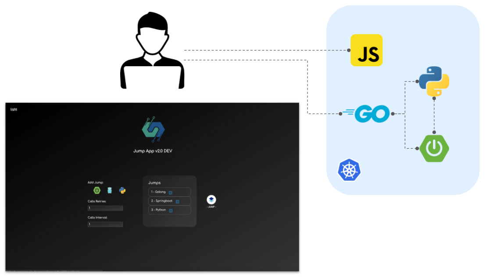

# Microservices

As mentioned before, *Jump App* is a multi microservices application based on different programing languages. The general goal is to allow users to configure a set of jumps between *Jump App* components and generate a continuous traffic flow defining the number of retries and their span of time.

As many of applications, *Jump App* is base on a frontend microservice and a set of backend microservices in order to implement the functionality in a modular architecture. The following picture shows this architecture with a simple graph:



The following sections describe this modular architecture in an overall perspective.

## Fronted

The frontend is an application based on React which implements an interface to generate flow between the backend microservices. It also include a settings section which allows users to configure a set of microservices jumps, their sequence, the number of these jumps retries and the span of time between them.

## Backends

The main objective of these backend components are to implement an API path */jump* which receives a request and operate as follows:

- GET Request - Return a JSON object with 2 fields, code and message, which includes the status request code and a custom message including the microservices technology which is handling the connection:

```$json
{
    "code": 200,
    "message": "/jump - Greetings from XXXXX!"
}
```

- POST Request - Receive a JSON Object, called *Jump*, and send a request to the next *jump* based on the information included in jumps field in the object. When *jumps* field contains only one jump, a GET request is perform, if not a POST request is send deleting the respective jump (n-1):

```$bash

$ curl -XPOST -H "Content-type: application/json" -v -d '{
    "message": "Hello",
    "last_path": "/jump",
    "jump_path": "/jump",
    "jumps": [
        "http://golang:8442",
        "http://python:8444" 
    ]
}' 'springboot:8443/jump'  # Send a POST to SPRINGBOOT

## First Jump 
CLIENT -> SPRINGBOOT

'{
    "message": "Hello",
    "last_path": "/jump",
    "jump_path": "/jump",
    "jumps": [
        "http://golang:8442", # Send a POST to GOLANG
        "http://python:8444" 
    ]
}'


## Second Jump
GOLANG -> PYTHON

'{
    "message": "Hello",
    "last_path": "/jump",
    "jump_path": "/jump",
    "jumps": [
        "http://python:8444" # Send a GET to PYTHON
    ]
}'

## Response
PYTHON

{
    "code": 200,
    "message": "/jump - Greetings from Python!"
}
```

*NOTE*: A part of that, it is possible to find other features included SPRINGBOOT which allow users to databases.


## Author Information

Asier Cidon @Red Hat

asier.cidon@gmail.com
